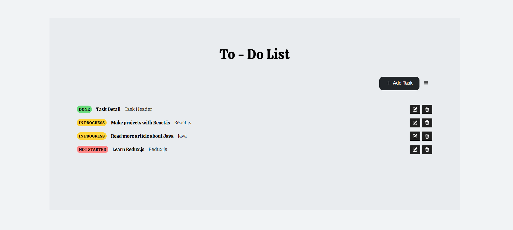

# TO-DO List

Advanced Fullstack Mastery Bootcamp ile öğrendiğim yeni bilgiler ışığında TO-DO List uygulaması için database bağlantısını sağladım ve API endpoint'leri oluşturdum. Başlangıçta ekrana gelen taskları CommandLineRunner ile oluşturup veri tabanından GET isteği ile aldıktan sonra task ekleme ile CREATE, güncelleme ile UPDATE, silme ile DELETE işlemilerini yaptım ve CRUD işlemlerini bu proje kapsamında gerçekleştirdim. Bu projede React Query, Context API, Spring Boot, Docker, React.js, Spring Data, Spring API, MySQL, H2DB teknolojilerini kullandım.

 

Kullanıcı isterse Add Task butonuna basarak yeni bir görev oluşturp bunu veri tabanına kaydedebilir.

 

 

Ayrıca her task için update buttonuna basılarak default task verilerini getiren modal üzerinden değişiklik yapılarak update butonuna baıldığında güncelleme işlemi yapılacaktır.

 

 

Delete butonuna basarak taskın silinemesini sağlayabilirsiniz.

 

 

Sağdaki options menüsü ile bütün taskları silebilir veya taskları status bilgisine göre sıralayabilirsiniz.

 

 

 
